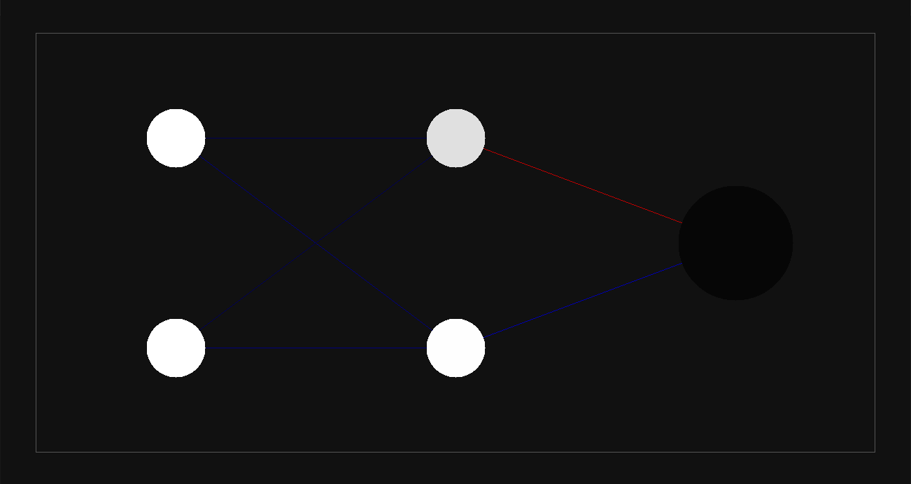
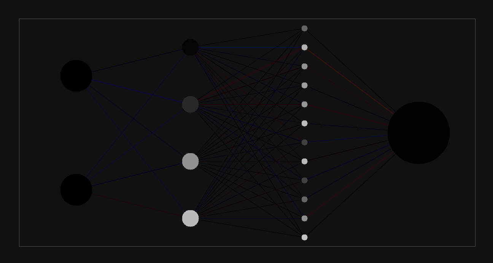

# Neural Network From Scratch With C

Welcome to the Neural Network From Scratch With C. This project aims to provide a simple yet effective way to visualize neural networks built from scratch in C programming language. The program utilizes the SDL library to create a visual representation of the neural network structure.

## Features
- Build neural networks from the ground up in C without any libraries
- Visualize the neural network using SDL graphics
- Simple and easy-to-understand implementation

## Screenshots

Simple architecture for computing XOR operation

Dynamically shows data flow through processing nodes and weights

## Dependencies
- SDL library

## Contributing
Contributions are welcome! If you'd like to contribute to this project, feel free to fork the repository and submit a pull request with your changes.

## License
This project is licensed under the [MIT License](LICENSE). Feel free to use, modify, and distribute the code as per the terms of the license.

Thank you for checking out the Neural Network From Scratch With C project! We hope you find it informative and valuable. If you have any questions or suggestions, please feel free to reach out.
